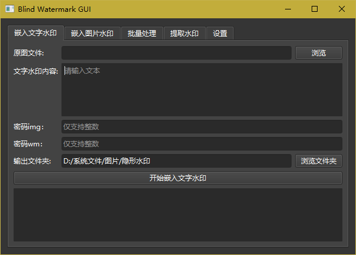
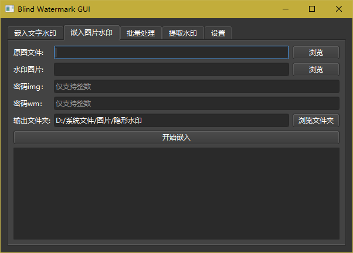
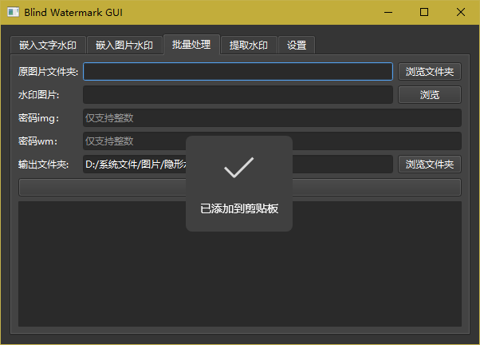
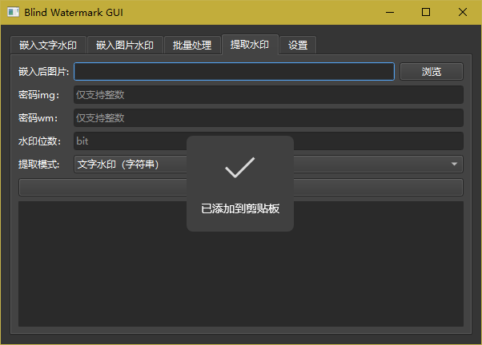
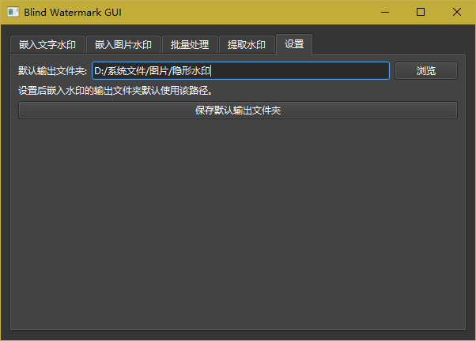

# 隐形水印 GUI（Blind Watermark GUI）

一个基于 **PySide6** 的图形界面，用于操作 [blind_watermark](https://github.com/guofei9987/blind_watermark) 库，提供便捷的图片/文字水印嵌入、提取与批量处理。

## 功能详情

- **嵌入文字水印**：把一段文字作为不可见水印嵌入原图



- **嵌入图片水印**：把一张图片作为不可见水印嵌入原图



- **批量处理**：对一个文件夹内的多张图片批量嵌入同一图片水印



- **提取水印**：从已嵌入水印的图片中还原出文字或图片水印



- **设置**：自定义默认输出文件夹，关闭软件后会自动记住



## 目录结构

```
│  ui_watermark.py     # GUI 主程序入口
│  build_exe.ps1       # 一键打包脚本（Windows）
│  ui_watermark.spec   # PyInstaller 打包配置（含体积优化）
│  requirements.txt    # 依赖清单
│  README.md           # 使用说明（本文件）
│  LICENSE             # MIT 许可证
│
└─ blind_watermark/    # 盲水印核心库（fork 自 guofei9987，含中文路径兼容修复）
```

## 环境要求

- Python 3.8+（开发打包使用 3.14 测试通过）
- 依赖见 `requirements.txt`：PySide6、numpy、opencv-python-headless、PyWavelets、pillow

## 安装与运行

```bat
# 建议使用虚拟环境
python -m venv venv
venv\Scripts\activate
pip install -r requirements.txt
python ui_watermark.py
```

> `blind_watermark` 库已随仓库提供在 `blind_watermark/` 目录，无需单独安装。

## 输出文件命名规则

生成的水印文件遵循以下模板：

```
{序号}-{password_img}-{password_wm}-{水印位数}{扩展名}
```

- `序号`：单文件嵌入固定为 `1`，批量处理从 `1` 开始递增
- `password_img`：图片密码（整数）
- `password_wm`：水印密码（整数）
- `水印位数`：水印的 bit 数（图片水印自动计算，文字水印为 `文字 UTF-8 字节数 × 8`）
- `扩展名`：沿用原图后缀（png、jpg 等）

示例：`1-2-1-40.png` 表示：`index-img-wm-bit.png`。

## 默认输出文件夹

- 首次启动时，默认输出文件夹为**系统“图片”目录下的 `隐形水印` 子文件夹**（不存在会自动创建）。
- 在「设置」标签页中可以自定义默认输出文件夹，点击「保存」后立即生效。
- 设置通过 Qt 的 `QSettings` 持久化，**关闭软件再次打开后不会丢失**。

## 打包为 EXE（Windows）

使用 PyInstaller 打包为单文件可执行程序：

```bat
pip install -U pyinstaller
py -3 -m PyInstaller --noconfirm --clean ui_watermark.spec
```

生成文件位于 `dist\ui_watermark.exe`，双击即可运行，无需安装 Python 环境。

也可直接运行仓库内的一键打包脚本：

```bat
powershell -ExecutionPolicy Bypass -File build_exe.ps1
```

> `ui_watermark.spec` 内置体积优化：会过滤掉视频编解码、软件 OpenGL 等本程序用不到的二进制，将 exe 从约 92 MB 减小到约 69 MB。

## 注意事项

- 嵌入水印时请确保原图尺寸足以容纳水印信息（容量不足会给出提示，不会崩溃）。
- 图片路径支持中文，已针对 Windows 下 OpenCV 无法读取非 ASCII 路径的问题做了兼容处理。

## 许可证

本 GUI 基于开源库 [blind_watermark](https://github.com/guofei9987/blind_watermark)（MIT License，Copyright (c) 2019 郭飞）开发，遵循相同 MIT 协议发布。